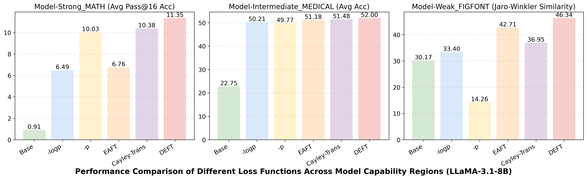
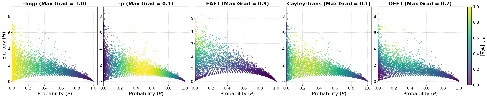
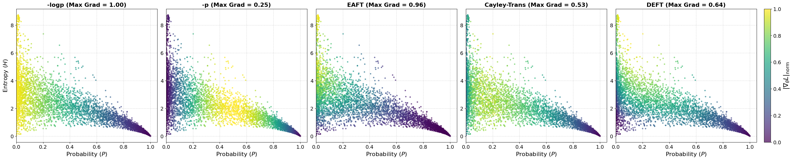
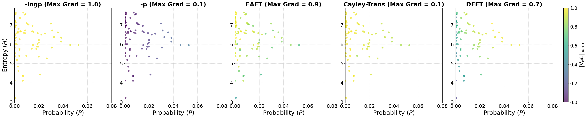
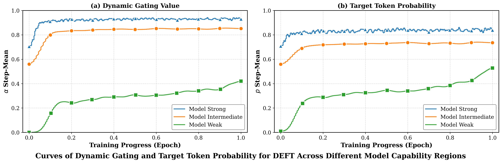

## DEFT: Dynamic Entropy Fine-Tuning for Adaptive Gradient Allocation in LLM Training

<div align="center">


[](https://github.com/luludus/DEFT)&#160;
<a href="https://arxiv.org/pdf/2602.11424" target="_blank"></a>
</div>


### Overview
Standard SFT with token-level NLL uses **uniform token weighting**, which can over-amplify rare/low-probability targets (including noisy supervision) while offering diminishing sharpening gains on already confident tokens. As a result, training faces a persistent exploration--exploitation tension: **learn new concepts** without **overwriting robust priors**.

We propose **Dynamic Entropy Fine-Tuning (DEFT)** to make gradient allocation **prediction-state-dependent**. Under a unified deformed-log family (including Tsallis q-log), we expose a universal **gate × error** gradient form. Using a Cayley-transform-derived continuous **focus trajectory**, optimization smoothly interpolates between NLL-like coverage when uncertain and probability-scaling-like sharpening when confident. A **parameter-free** DEFT variant further modulates the gate via distribution concentration (Rényi-2 entropy), serving as a computable proxy of predictive state.


### Key Advantages

- **Unified objective view (deformed-log / Tsallis q-log):** Within a unified deformed-log framework induced by Tsallis q-log, we reveal a universal **“gate × error”** gradient structure for token-level objectives, where the **gate** characterizes how much the model “trusts” its current prediction.
- **Geometry-driven, continuous focusing (Cayley transform):** From a geometric perspective, we derive a continuous **focusing trajectory** via the Cayley transform, enabling the optimizer to smoothly behave like NLL when uncertain (coverage/learning) and like probability-scaling losses when confident (sharpening).
- **Noise-aware, parameter-free adaptation (Rényi-2 concentration):** To further distinguish “unknown blind spots” from “conflicting noise” in data, we introduce a parameter-free DEFT variant that uses distribution concentration (Rényi-2 entropy) as a computable proxy of predictive state to adaptively modulate the gate during training.

#### Performace Comparison
<div align="center">
  <table>
    <tr>
      <td align="center">
        <div></div>
      </td>
    </tr>
  </table>
</div>

#### Token-level gradient distributions across model capability regions. (Top: model-strong; Medium: model-medium; bottom: model-weak.)
<div align="center">


  <div>
    <br/>
    <br/>
    
  </div>
</div>

#### Adaptive gating dynamics during DEFT training
<div align="center">
  <table>
    <tr>
      <td align="center">
        <div></div>
      </td>
    </tr>
  </table>
</div>


### Repository layout

- `main_verl/trainer/fsdp_sft_trainer.py`: FSDP SFT trainer with token-level objective transformations.
- `main_verl/trainer/config/sft_trainer.yaml`: Default Hydra config for SFT.
- `scripts/one_click/`: One-command script generator to run training + evaluation.
- `scripts/training/` and `scripts/evaluation/`: Example scripts per dataset.
- `data/`: Data preparation scripts.
- `evaluations/`: Evaluation code for Math / Medical / FigFont.

### Requirements

Base environment: `python>=3.10` + a modern PyTorch/Transformers stack.

```bash
pip install torch transformers flash-attn
pip install verl==0.4.0.dev0
```
Math eval dependencies:
```bash
pip install -r evaluations/math/requirements.txt
pip install -r evaluations/math/latex2sympy/requirements.txt
```


### Quick start


```bash
# DATASET              : math | medical | figfont
# MODEL_KEY            : predefined key in scripts/one_click/TEMPLATE.py (e.g., llama-3.1-8b, ...)
# OBJECTIVE            : token-level objective transformation passed to trainer.objective_trans (original | p | Cayley_Trans | DEFT)
# run_script           : optional; if set, the generated script will be executed immediately
# nproc_per_node       : number of GPUs to use
# cuda_visible_devices : GPU IDs (e.g., 0,1,2,3)

python scripts/one_click/script_generator.py \
  --dataset "$DATASET" \
  --model_save_name "$MODEL_KEY" \
  --trainer_objective_trans "$OBJECTIVE" \
  --run_script
```

### Acknowledgements
The implementation of this repository is built upon [veRL](https://github.com/volcengine/verl) and [Beyond-Log-Likelihood](https://github.com/GaotangLi/Beyond-Log-Likelihood). We sincerely appreciate the efforts of these teams for their contributions to open-source research and development.

### Citation
If you find this repository useful, please cite:
```bash
@misc{wang2026gradientsearninfluenceunifying,
      title={Gradients Must Earn Their Influence: Unifying SFT with Generalized Entropic Objectives}, 
      author={Zecheng Wang and Deyuan Liu and Chunshan Li and Yupeng Zhang and Zhengyun Zhao and Dianhui Chu and Bingning Wang and Dianbo Sui},
      year={2026},
      eprint={2602.11424},
      archivePrefix={arXiv},
      primaryClass={cs.CL},
      url={https://arxiv.org/abs/2602.11424}, 
}
```
